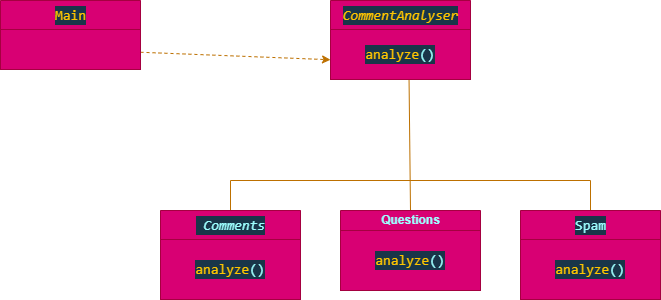

Please **note** that there are three branches in this repo, *main*, *task3-in-dev-mode* and *master*. <strong>Master *has my latest version code*</strong> so all the finally code will be in the master branch. But because this my final submission  *task3-in-dev-mode* branch is now up to date with the master branch. Can trace my commits on each branch. <br /> <br/>


# My Approach

 ### So I envisioned approaching the task in the following ways:

 - ### polymorphism
  
   -   Using polymorphism (poly means *many* and morphism means *form*.). So it means the ability of an object to take many different forms.
  
   - That means that we will have a method by the name analyze which will be implemented differently depending on the type of comments class we have.
     - I noticed that this method is the same in all types of comments classes( <strong>Comments</strong>, <strong>Spam</strong>,  <strong>Questions</strong>). The aim here is to analyze comments right so polymorphism takes form in this case. My first approach is to try to make the program more maintainable and accessible in the future.
     - ok let's try out polymorphism
     - The main/ App class talks with CommentAnalyzer class, which is the base for other classes
     -  in commentAnalyzer class, we have an abstract class called analyze
     -  The analyze method is implemented in child classes(Comments, Spam, Questions)
     -  I believe this technique will take away the burden of if statement in the future
     -  any other type of comment will just call the method analyze on its implementation
     - See the UML digraph for more information about polymorphism implementation: <br /> <br/> 


       
        
- ## Programming to an interface
     - This can be the easiest way too. We can have each type of comment being a class( comments, Spam, Questions). CommentAnalyser will be the interface for all types of class comments. So that means each class comment will implement the interface according to its behavior method.
     - But I feel like this is still not object-oriented enough because we will need to have many different methods and implementations for each class comment.
     - Keeping in mind that the goal here is to analyze comments so having just one abstract method with the name analyze would perform better. This makes me favor polymorphisms over programming to an interface. <br/> <br/> 

         ```java

         //make an interface with a method to be implemented by child classes
        public interface CommentAnalyser {
        //make it a method commet analyzer of tabe of Map<String,Integer>
        public Map<String, Integer> AnalyzeComments(String fileName);

         }


        //classes to implement interface
       public class AnalyserQuestions implements CommentAnalyser {
       @Override
       public Map<String, Integer> AnalyzeComments(String fileName) {
            // TODO Auto-generated method stub
          return null;
         }
    
         }
    
        

        public class AnalyserSpam implements CommentAnalyser {
    
        @Override
       public Map<String, Integer> AnalyzeComments(String fileName) {
        // TODO Auto-generated method stub
        return null;
        }
        }
    
             


       public class AnalyserComment implements CommentAnalyser {

         @Override
       public Map<String, Integer> AnalyzeComments(String fileName) {
        // TODO Auto-generated method stub
        return null;
        }
    
       }


       ```


- ## Command pattern
  -   polymorphism worked out good but I still see some redundant. 
  -  so using Command pattern is another idea I had in mind.
  -  Given much time I would have loved to demonstrate Command pattern.


<br> <br>


- ## Using threads ( task3)


     <br>

  -
      FileRead class extends thread
      
    -  the code that reads the files is inside the run() method of the thread. Run() method is inherited and overridden by the FileRead class.
       Whithin the the  main method of the App class an instance of the FileRead class is created and call its start() method to start the thread.
       - **Note:** there is no other activities in the main method of the App class other than the start() method. I would have used the isAlive() or join() method to  Wait for this thread to die. before start doing any other operations.


   - Concurrency Problems
     - 
      Because threads run at the same time as other parts of the program, sometimes  there is no way to know in which order the code will run. 
      
      - When the threads and main program are reading and writing the same variables, the values are unpredictable. Which is not the case in my code.  To avoid concurrency problems, I have decided to share few attributes between threads and the other parts of the code. I would have used the <strong> *isAlive()*</strong>   method of the thread to check whether the thread has finished running before using any attributes that the thread can change.


           <br> <br>

           ### Another solution I had in mind which I think would perform better
           ---
           process multiple files simultaneously by assigning number of threads on runtime. 
        - Advantage to this:
            
          - Can assign N number of threads on runtime based on CPU utilization.
          - Can process all the files in less time.
  
           <br>

         ### Aproach:
  

        - Get the list of all files in Array.
        -  Assign number of threads.
         - Assign files equally to each thread.
        - Assign remaining files to the last thread.
         -  Run all the threads and wait to complete execution of all the threads
          -  make sure that when  obtaining several locks, I acquire them in the same order across all threads in order to prevent deadlock
          -  This is the glimpse to the bonus question check code snippet bellow:

          <br>

  ``` Java

  Map<String, Integer> totalResults = new HashMap<>();
		//Get the list of all files in Array.
	File docPath = new File("docs");
		final File[] commentFiles = docPath.listFiles((d, n) -> n.endsWith(".txt"));
		// Assign number of threads.
   		int numThreads =2;
		//Assign files equally to each thread.
		//Assign remaining files to the last thread.
		Thread[] threads = new Thread[numThreads];
		final int filesPerThread=commentFiles.length/numThreads;
		final int remainingFiles = commentFiles.length%numThreads;
    
	//Run all the threads and wait to complete execution of all the threads.
	for (int i = 0; i < numThreads; i++) {
	final int thread = i;
	threads[i] = new Thread() {
		public void run() {
			runThread(commentFiles, thread, filesPerThread, remainingFiles);
			for (int j = 0; j < filesPerThread; j++) {
				File file = commentFiles[thread * filesPerThread + j];
				CommentAnalyzer analyzer = new CommentAnalyzer(file);
				Map<String, Integer> resultsMap = analyzer.analyze();
				totalResults.putAll(resultsMap);
			}
		}
			};
		try {
			threads[i].start();
			threads[i].join();
		} catch (InterruptedException e) {
			e.printStackTrace();
			}
			}
	
	}


	private static void runThread(File[] commentFiles, int thread, int filesPerThread, int remainingFiles) {
			
		try {
			Thread.currentThread().setPriority(Thread.MAX_PRIORITY);
            Thread.currentThread().setContextClassLoader(  Thread.currentThread().getContextClassLoader());

			if (thread > 0) {
                Thread.currentThread().start();
            }
            
            long start = System.currentTimeMillis();

		}
		catch (Exception e) {
			e.printStackTrace();
		}
	

	private static void incOccurrence(Map<String, Integer> totalResults, String key) {
		if (totalResults.containsKey(key)) {
			totalResults.put(key, totalResults.get(key) + 1);
		} else {
			totalResults.put(key, 1);
		}

  ```


  There are many solutions to this. I hope I am not over engineering with my wild thoughts.

  By the way this is a tech check!
  <br>
  ### Happy coding!

  <br>
  
  ## Author

   [Snaye Sotashe](https://github.com/SOTASHE)
